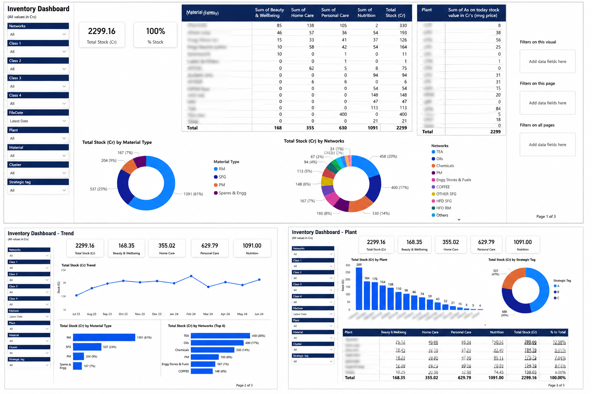
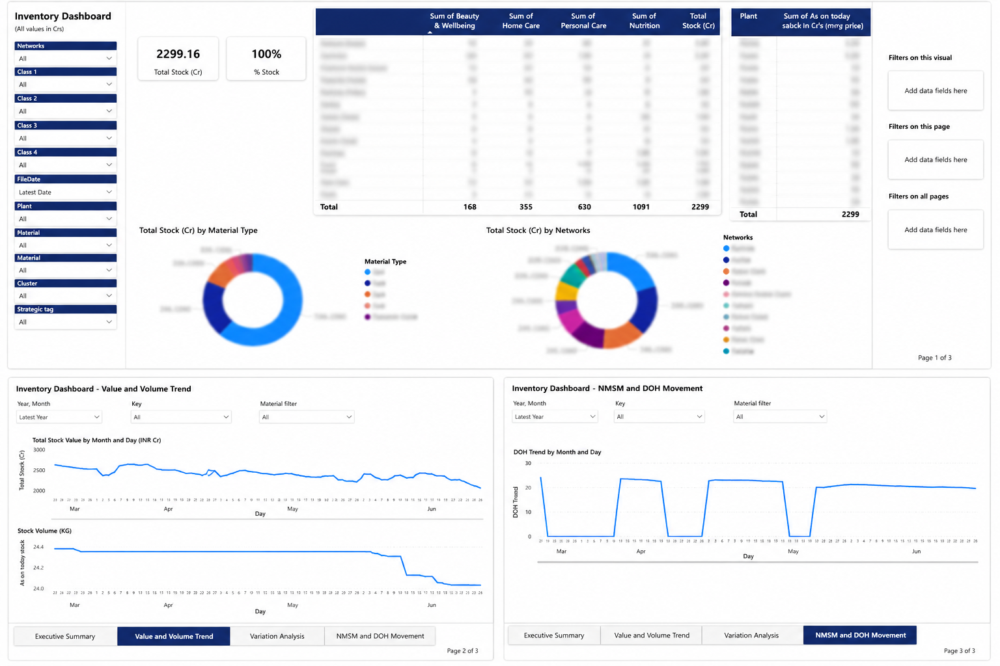

# Inventory Analytics Dashboard

## Business Problem

Many inventory reports were being tracked manually in spreadsheets, making it difficult to monitor daily inventory changes and identify important trends.

This dashboard was built to provide better visibility into inventory performance and help users:

- Monitor inventory trends over time.
- Track inventory at different business levels.
- Identify unusual changes in stock.
- Understand whether inventory movement is driven by price or quantity.
- Support faster and more informed business decisions.

---

## Tools Used

- Power BI
- DAX
- Power Query
- Google BigQuery
- SQL
- Power Automate

---

## Dashboard Pages

### Executive Summary

### Value & Volume Trend

---

## Key Features

- Executive KPI Dashboard
- Inventory Trend Analysis
- Stock Value Monitoring
- Interactive Filters
- Drill-down Analysis

---

## Skills Demonstrated

- Data Modeling
- DAX
- Power Query
- Dashboard Design
- Business Intelligence
- Power Automate
