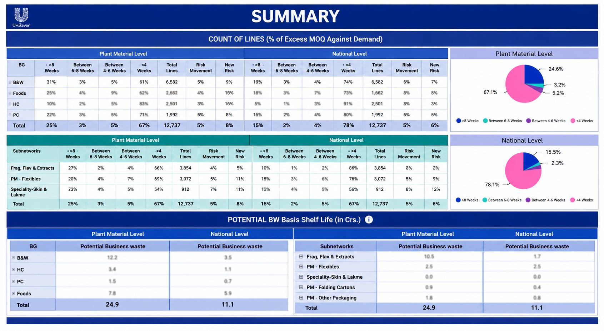
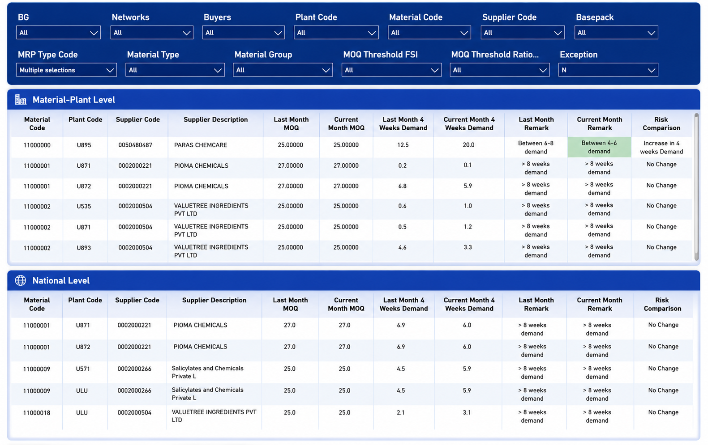

# MOQ Analytics Dashboard

## Business Problem

Managing Minimum Order Quantity (MOQ) manually across multiple plants and suppliers made it difficult to identify excess inventory and business risk.

This dashboard was developed to help business users:

- Monitor excess MOQ against demand.
- Identify high-risk materials and suppliers.
- Track potential business waste.
- Improve inventory planning through interactive analysis.

---

## Tech Stack

- Power BI
- DAX
- Power Query
- SharePoint
- Power Automate

---

## Dashboard

### Executive Summary

### Material Analysis

---

## Key Features

- MOQ Risk Monitoring
- Potential Business Waste Analysis
- Plant vs National Comparison
- Interactive Filtering
- Material Level Analysis

---

## Skills Demonstrated

- Data Modeling
- DAX
- Power Query
- Power Automate
- Business Intelligence
- Dashboard Design
